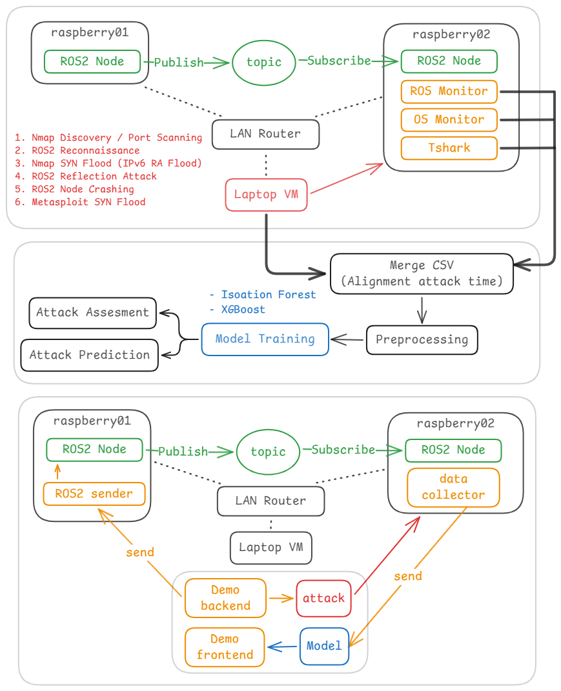

## 執行流程與步驟

### 1. Data Collection
1. 將 `raspberry_subscriber/monitor/` 複製至被攻擊方 (raspberry02)
2. 建立 ROS2 基本傳輸節點，並更改 `tmux_start.sh` 中的 subscriber 啟動方法
3. 被攻擊方 command `source tmux_start.sh` 會在各自的目錄中自動執行 linux_monoitor.py、ros2_monitor.py、tshark、subscriber 指令
4. 執行發送 ROS2 封包的 rospberry01 中自訂的 publisher 程式
5. 將 `rospace_dataset/attack/` 複製至攻擊方 (vm)
6. 攻擊方啟動 msf 後台 `msfrpcd -P pentest -n -f`
攻擊方 command `sudo python3 attack.py -s {SOURCE_IP} -t {TARGET_IP} -c 2 -cr 2 -cp 2 -l 5` (可自行更改次數) 針對被攻擊方攻擊
7. 待到攻擊結束，將所有程式中斷

### 2. Data Preprocessing
1. 將被攻擊方 (raspberry02) 中 monitors 所產生的檔案 (`OS_monitor.csv`、`ros2_monitor.csv`、`temp_capture.pcapng`) 複製至此
2. 將攻擊方 (VM) 攻擊後所產生的 `attacl.log` 複製至此
3. 依照 main.ipynb 流程執行 (記得修改路徑)
    - `1_processing/custom_pcapng2csv.py`: 將 `temp_capture.pcapng` 攤平成 csv 格式
    - `1_processing/csv_merging_parallel.py`: 將剛剛轉換的 csv 與 `OS_monitor.csv`、`ros2_monitor.csv` 合併並依據 `attack.log` 進行 label
    - `2_labeling/label`: 在資料量過大，buffer 不夠時，在 merge 後使用

4. 執行 `3_complete_dataset/complete_dataset_composition.ipynb`: 檢查數據、數據清理
5. 執行 `4_reduced_and_noperiodicity_dataset/reduced_dataset_composition.ipynb`: 刪除不重要的欄位
6. 執行 `4_reduced_and_noperiodicity_dataset/no_periodicity_dataset.ipynb`: 隨機裁切連續時間序並重塑時間軸以消除週期性

### 3. Model Training
執行 `5_usage_notes/usage_note_A_detection_shuffled.ipynb`: 訓練模型並輸出 npy 和 pkl 檔案

### 4. Application
1. 將 `/RB2/` 複製至 raspberry02
2. 將 `/RB1/` 複製至 raspberry01
3. 將 `/VM/` 和模型的 npy、pkl 檔案複製至 VM
4. 在 raspberry02 利用 `setup.py` 和 `subscriber.py` 建置 ROS2 subscriber
5. 在 raspberry02 分別執行 `os_monitor.py`、`pyshark_monitor.py`、`ros_monitor.py`
6. 在 raspberry01 利用 `setup.py` 和 `publisher.py` 建置 ROS2 publisher
7. 在 VM 啟動 msf 後台 `msfrpcd -P pentest -n -f`
8. 在 VM 分別執行 `main_web.py`、`attacker.py`、`data_process.py`、`model_engine.py`